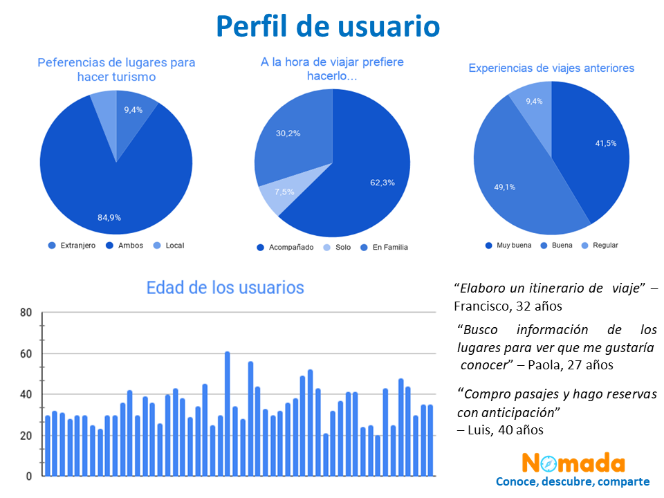
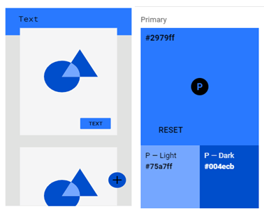

# **Nómada**

## Índice

* [1. Nómada](#1-nómada)
* [2. Investigacion UX](#2-investigación-ux)
* [2.1 Usuarios](#2.1-usuarios)
* [2.2 Problemática y solución](#2.2-problemática-y-solución)
* [2.3 Historias de usuario](#2.3-historias-de-usuario)
* [2.4 Proceso de prototipado](#2.4-proceso-de-prototipado)

***

## 1. Nómada

Conoce, descubre, comparte

Nómada la aplicación web para viajeros y aventureros, donde podrás compartir tus experiencias de viaje y conectar con otros, fomentando la comunidad y el enriquecimiento cultural.

        'Imagen final del proyecto'

## 2. Investigación UX

  >*“En esta nueva década, veremos cómo la industria de viajes trata de dar respuesta a las necesidades de un tipo de viajero más preocupado por la sostenibilidad, y con más conocimientos tecnológicos e inquietudes, mediante el desarrollo de productos, servicios y funciones que hagan que descubrir el mundo sea más fácil para todos.”*, afirma Arjan Dijk, vicepresidente sénior y Chief Marketing Officer de Booking .com.

Según un estudio realizado por Booking .com y realizado de forma independiente entre adultos que habían viajado en los últimos 12 meses o que pensaban hacerlo en los próximos 12, se obtuvo:

   -Al 60% de los viajeros globales les gustaría tener acceso a un servicio (app/web) que les recomendase destinos en los que un aumento del turismo tendría un impacto positivo en la comunidad local.
   -El 59% de las personas quiere que la tecnología les proponga opciones que les sorprendan con algo totalmente nuevo.

Cualquier usuario se convierte en fuente de inspiración para otros: según Hosteltur, más del 92% de los viajeros sienten el impulso de compartir sus experiencias en redes sociales. Por la autenticidad del contenido  compartido, los usuarios no sólo  deciden dónde  será su próximo  viaje sino que  también  buscan alojamiento,  actividades, o restaurantes donde disfrutar de su estancia.

Para el proceso de research UX que nos permitió identificar a los potenciales usuarios de una red social para viajeros, se realizaron encuestas utilizando la herramienta Google Forms, y además nos encontramos con una problemática común en ellos.

[Enlace al Form](https://docs.google.com/forms/d/e/1FAIpQLSdHeU1JGJorLCty8IiqriveXfOzHl2MXzyWTxr3jzzxWIE6Zw/viewform?usp=sf_link)

### 2.1 Usuarios

Los usuarios, son el adulto contemporáneo con un rango etario definido entre los 20 a los 60 años. Los mismos comparten el amor por la naturaleza, los viajes y en muchos casos la aventura de explorar sitios nuevos. Así mismo indicaron que viajan cada vez que tienen la oportunidad lo cual  nos permite catalogarlos como ‘viajeros frecuentes’, que esperan que su experiencia de viaje sea única e irrepetible.

  

Estos a su vez, utilizan  frecuentemente redes sociales, como  Instagram y Facebook  para subir fotos mientras están de vacaciones y  continúa  haciéndolo a  su vuelta  a fin de  compartir sus  experiencias  con familiares  y amigos, dicha interacción se basa únicamente en postear fotos siempre y cuando la experiencia haya sido buena, y raramente llegando a interactuar con personas fuera de su círculo social que puedan interesarse en conocer experiencias de viaje y compartir las suyas mismas.

### 2.2 Problemática y solución

Tomando en cuenta la necesidad  de los usuarios  de compartir  sus experiencias de  viaje, surge Nómada un espacio para compartir e  interactuar con otros  que viajen frecuentemente, donde  no simplemente  se muestre una imagen bonita como reseña de algún viaje, sino que pueda ser un espacio seguro para compartir las experiencias de viaje, aún si estas sean  buenas o no tan buenas, ayudando de esta forma a otros viajeros al momento de planificar sus viajes y así fomentar las relaciones e interacciones entre los usuarios, llegando a crear una comunidad.

Una Aplicacion  como Nómada supone  también una gran  oportunidad para  las compañías de viajes,  aerolíneas  y cadenas hoteleras. A  través de  los likes, intereses  e interacciones de los usuarios,  las marcas dedicadas al turismo pueden reconocer qué destinos son los que más interesan, de forma que puedan crean promociones personalizadas para cada uno de ellos.

### 2.3 Historias de usuario

Una vez identificada la problemática y los usuarios a los cuales estaría dirigida la aplicación se desarrollaron las historias de usuario, las cuales definen la aplicación y lo que los usuarios quieren lograr en ella. Las cuales son las siguientes:

* Historia de usuario Nro. 1 : Yo como usuario quiero poder crear una cuenta personal para poder acceder a la aplicación.

* Historia de usuario Nro. 2 : Yo como usuario quiero poder ingresar utilizando mi cuenta personal de Google, para no tener que registrarme o crear una cuenta nueva.

* Historia de usuario Nro. 3 : Yo como usuario quiero poder hacer una publicación: Para compartir la experiencia con el resto de la comunidad.

* Historia de usuario Nro. 4 : Yo como usuario quiero poder visualizar otras publicaciones para conocer y compartir la experiencia de otros usuarios.

* Historia de usuario Nro. 5 : Yo como usuario quiero poder ver destinos destacados, para tener referencias de lugares que puedo visitar.

### 2.4 Proceso de prototipado

Es importante destacar que en un primer momento la aplicación a esta se le había dado el nombre de TravelEX, como resultado de la encuesta se le cambió el nombre ya que se recibieron feedbacks de que el nombre anterior era confuso, en ese momento surge el nombre Nómada.

Antes de comenzar el proceso de pototipado se definieron premisas importantes para la interfaz de Nómada:

    1.Tiene que ser limpia y agradable a la vista.
    2.Debe ser sencilla.
    3.Debe poder utilizarse rápidamente sin la necesidad de realizar muchos pasos para cargar o editar 
      alguna publicación.
    4.Debe ser intuitiva.

  

De estos se recibieron feedback en cuanto a hacer la interfaz más descriptiva para el usuario y que de esa forma la experiencia de usuario fuese más amigable. Se realizaron las iteraciones necesarias y posteriormente se definieron tipografías a utilizar, paleta de colores y se diseñó el logo de la aplicación. Para luego dar paso a la maquetación en Figma, obteniendo así el prototipo de alta fidelidad.

  Las tipografías utilizadas son del tipo Sans Serif, para no causar distracción al usuario se utiliza la misma tipografía en todos los textos de la aplicación.

  

  La selección de colores se llevo a cabo pensando en brindar confianza y seguridad al usuario, por eso se seleccionó el color azul como base y se emplea en distintas intensidades, a su vez, este es represetativo del océano y el cielo.

  

  El logo de la aplicación se diseño como un isologo, incluyendo una brújula dentro de la palabra Nómada reemplazando la letra o, de esta forma se concibe como un todo, y los elementos son complementarios de los otros. Se utilizó el naranja para el logotipo para crear contraste con la paleta de colores utilizada.

  

  prototipo de alta fidelidad en figma
  